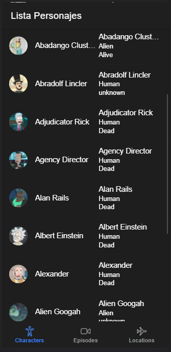

# Ionic Rick and Morty API

---

### Description
Small frontend app using the rick and morty api, made when learning Angular y IONIC

[Rick and Morty API](https://rickandmortyapi.com/)

---

## Use

To run a ionic application, clone the repo, run npm install to get the needed packages and ionic serve to run it in a local server.

---

## Technologies

- Ionic
- Type Script

---
## Author Info

- Linkedin - [Federico Andrés Jácome Castañeda](https://www.linkedin.com/in/federicojacome/)
- Website - [To be added](https://github.com/federocky)

[Back To The Top](#read-me-template)
